# Travel Africa
Travel Africa is a website that celebrates the natural beauty and rich culture of Africa. It is a space where travel enthusiasts and adventurers from all over the world can share their recommendations, and tips for exploring the continent.

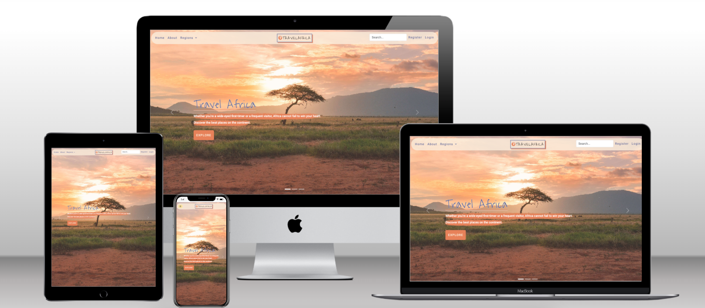

# Live Project

[View live project here](https://travel-africa.herokuapp.com/)

## Contents

---

- [User Experience (UX)](#user-experience-ux)
    - [Website Goal](#website-goal)
    - [Target Audience](#target-audience)
    - [User Stories](#user-stories)
- [Design](#design)
  - [Colour Palette](#colour-palette)
  - [Fonts](#fonts)
  - [Images](#images)
  - [Wireframes](#wireframes)
- [Agile methodology](#agile-methodology)
  - [MoSCoW method and story points](#moscow-method-and-story-points)
  - [Iterations](#iterations)

---

## <a name="ux">User Experience</a>

### <a name="website-goal">Website Goal</a>

Goals of the Travel Africa blog are: 
- To provide a platform where people can easily share information about Africa
- To inspire people to travel to Africa and explore the continent
- To create a community of like-minded travelers
- To provide valuable information and resources

### <a name="target-audience">Target Audience</a>

- People who love to travel and are interested in exploring the natural beauty of Africa.
- Individuals from different age groups, backgrounds, and nationalities.

### <a name="user-stories">User Stories</a>

- As a first-time visitor,
  - [#1](https://github.com/kerstin-w/Travel-Africa/issues/1) I want to know what this site is about immediately so that I can decide whether I will explore further.
  - [#2](https://github.com/kerstin-w/Travel-Africa/issues/2) I want to navigate pages so that I can understand what types of information I can find.

 

- As an unregistered User,
  - [#3](https://github.com/kerstin-w/Travel-Africa/issues/3) I can view a list of posts so that I can select one to read.
  - [#4](https://github.com/kerstin-w/Travel-Africa/issues/4) I can select a category so that I can only view relevant posts.
  - [#5](https://github.com/kerstin-w/Travel-Africa/issues/5) I can view a list of highlights posts so that I can select one to read.
  - [#6](https://github.com/kerstin-w/Travel-Africa/issues/6) I can create an account so that I can sign in and use of the sites full functionality.
  - [#13](https://github.com/kerstin-w/Travel-Africa/issues/13) I can search a post by a keyword so that I can try to find posts relative to the keyword.
  - [#15](https://github.com/kerstin-w/Travel-Africa/issues/15) I can view comments so that I can read other users feedback.

 

- As an registered User,
  - [#7](https://github.com/kerstin-w/Travel-Africa/issues/7) I can view my own account so that I can manage my account easily.
  - [#8](https://github.com/kerstin-w/Travel-Africa/issues/8) I can Edit/Update my account so that my profile is up to date.
  - [#9](https://github.com/kerstin-w/Travel-Africa/issues/9) I can delete my account so that I can remove my footprint from the website if I am no longer active.
  - [#10](https://github.com/kerstin-w/Travel-Africa/issues/10) I can create a post so that I can share my experiences with other users.
  - [#11](https://github.com/kerstin-w/Travel-Africa/issues/11) I can edit my posts so that I can keep them current and amend mistake.
  - [#12](https://github.com/kerstin-w/Travel-Africa/issues/12) I can delete my posts so that I can control the information that I share.
  - [#14](https://github.com/kerstin-w/Travel-Africa/issues/14) I can leave a comment on a post so that I can exchange with the author an be involved in a conversation.
  - [#16](https://github.com/kerstin-w/Travel-Africa/issues/16) I can like a post so that highlight useful content for other users.
  - [#17](https://github.com/kerstin-w/Travel-Africa/issues/17) I can receive an email notification if another user commented on my post so that I can engage in a conversation with other users.
  - [#18](https://github.com/kerstin-w/Travel-Africa/issues/18) I can can add a Post to my bucket list so that I can save destinations I want to travel to.
  - [#19](https://github.com/kerstin-w/Travel-Africa/issues/19) I can delete my comments so that I can control the information that I share.
  - [#26](https://github.com/kerstin-w/Travel-Africa/issues/26) I can rely on the app to log me out automatically so that strangers cannot access my profile in case I am on a public computer.
  - [#27](https://github.com/kerstin-w/Travel-Africa/issues/27) I can be routed to a error page in case a page is not found so that I understand the error and click on a link to get back to the homepage.
  - [#31](https://github.com/kerstin-w/Travel-Africa/issues/31) I want to reset my password so that I can regain access to my account if I forget my password.
  
 

- As an Superuser,
  - [#28](https://github.com/kerstin-w/Travel-Africa/issues/28) I want to create a category when needed so that I can manage the site effectively.
  - [#29](https://github.com/kerstin-w/Travel-Africa/issues/29) I want to delete content when inappropriate so that I can maintain the site and ensure that only useful or relevant content remains
  - [#30](https://github.com/kerstin-w/Travel-Africa/issues/30) I want to block user accounts so that I can ensure only trusted users can access the site.

 

## <a name="desgin">Design</a>

### <a name="colour-palette">Colour Palette</a>

To create a colour palette, I used [_Mycolor.space_](https://mycolor.space/). The color palette consists of deep blues meant to evoke the sea and sky, warm yellows and oranges meant to evoke the sun, and a skin tone-like color that can be associated with the various cultures of Africa. The palette also includes a mellow white that reflects the natural and unspoiled beauty of African landscapes and wildlife, 

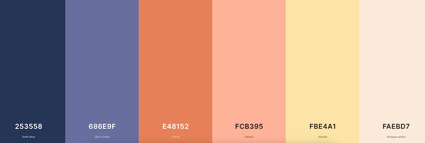

### <a name="fonts">Fonts</a>
[_Sourced via Google Fonts._](https://fonts.google.com/)

**Heading:** 
- For Headings, "Waiting for the Sunrise" font was selected, which has a handwritten and adventurous feel and complements the theme of travel and exploration.

**Body:** 
- “Roboto”, is a clean and modern font which is easy to read, making it a good choice for body text and enhancing readability for the readers. 

### <a name="images">Images</a> 

[*Sourced via Pexels.*](https://www.pexels.com/)

Images are an important aspect of the Travel Blog, as they help to enhance the users's experience and provide a visual representation of the destinations and experiences being discussed. They make the content more engaging and visually appealing. All images I used as blog creater, where compressed them with [TinyPNG](https://tinypng.com/). The downside is, that I cannot control the size of pictures uploaded by the user and its effect on the loading time. 

* The home page includes a carousel in the Hero banner, which shows three images of Africa to draw the user's immediate attention to Africa.

* Users can upload a picture of the destination in their blog post, which will be featured on the blog post page, as well as on the post list page. 

* Users can upload a picture of themselves in their profile to make it a more personalized experience.

### <a name="wireframes">Wireframes</a> 

    
Homepage

    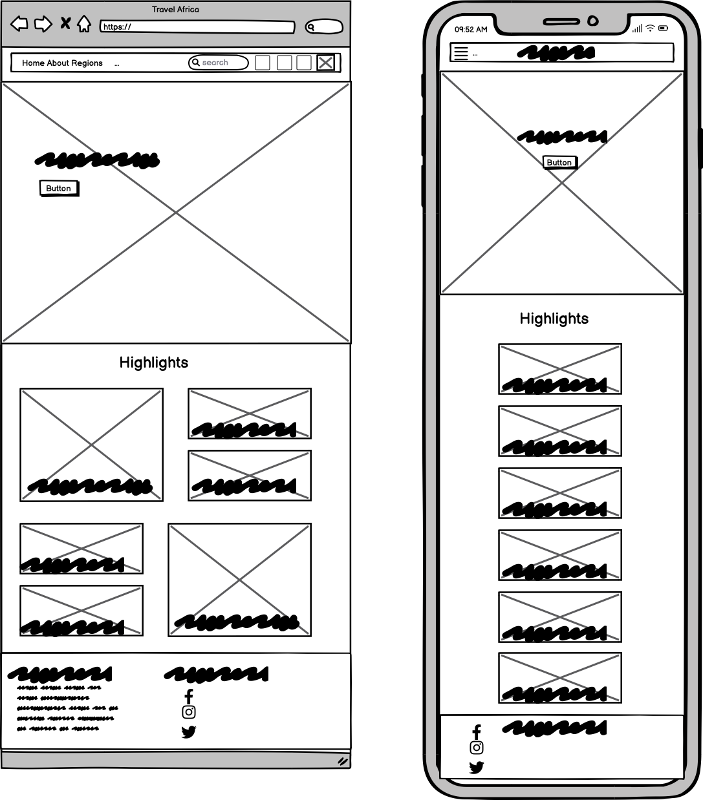

    
About Page

    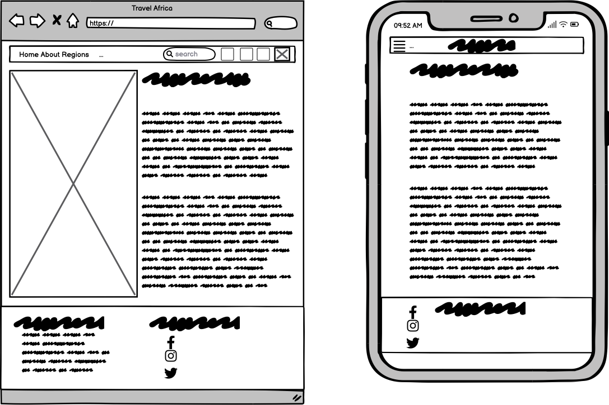

    
Regions

    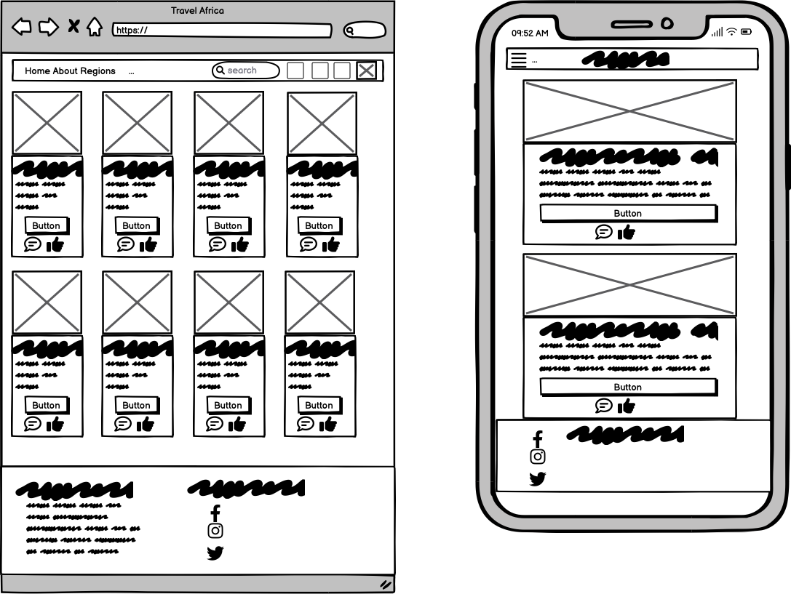

    
Search Results

    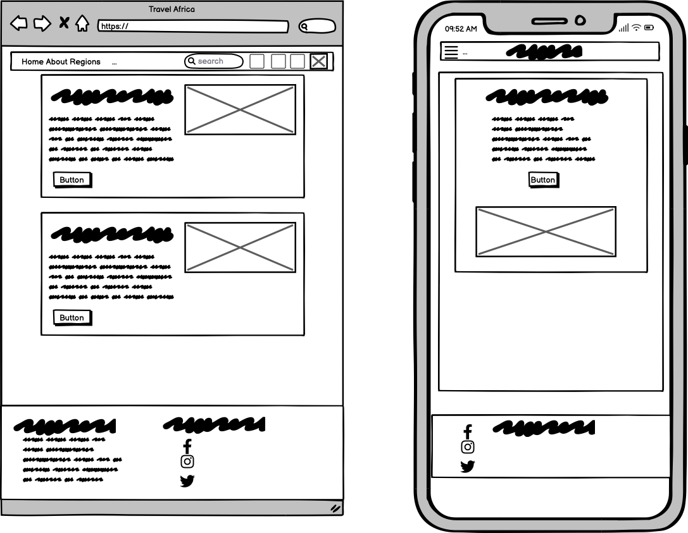

    
Register & Login

    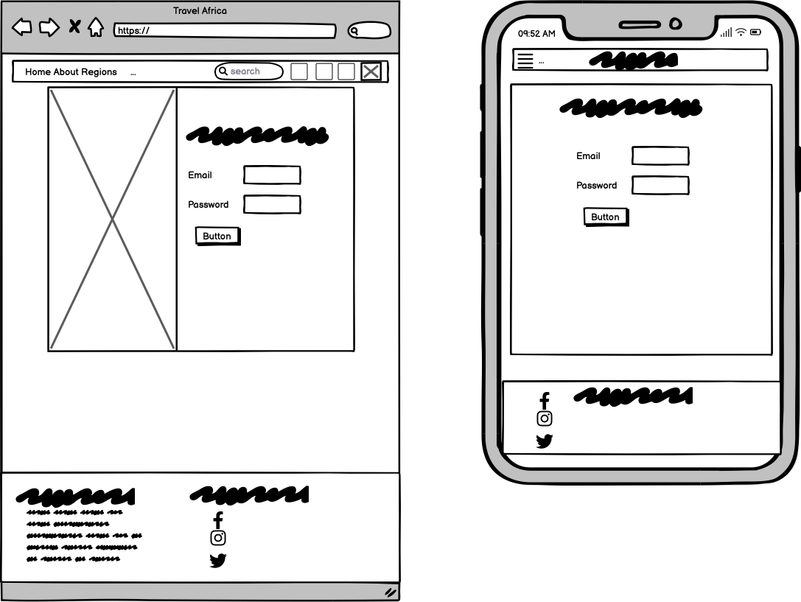

    
Profile (View of other registered users)

    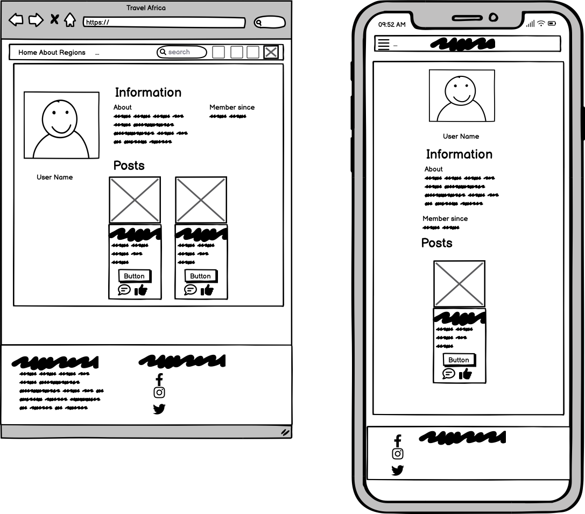

    
Profile (Own View)

    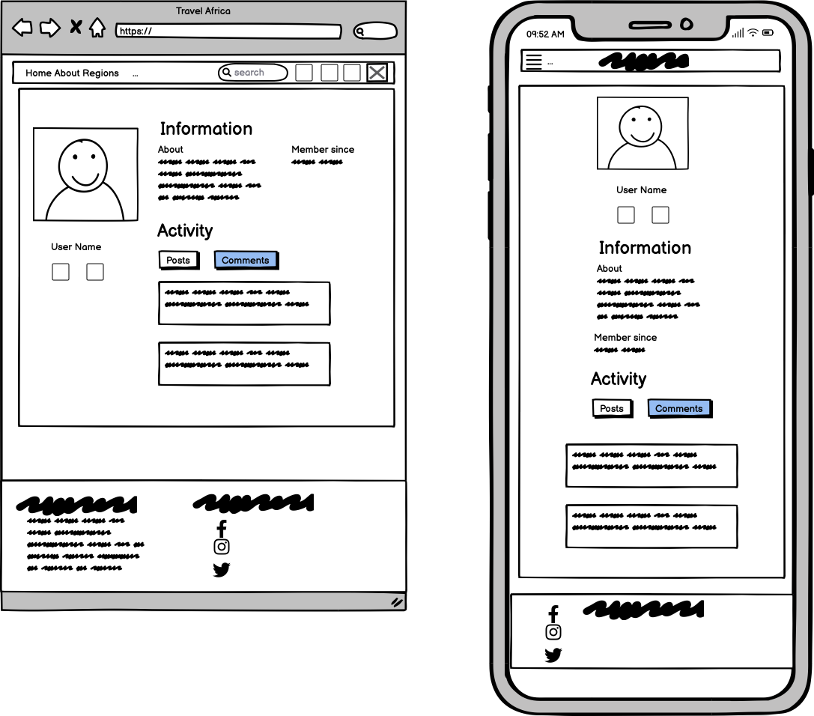

    
Edit Profile

    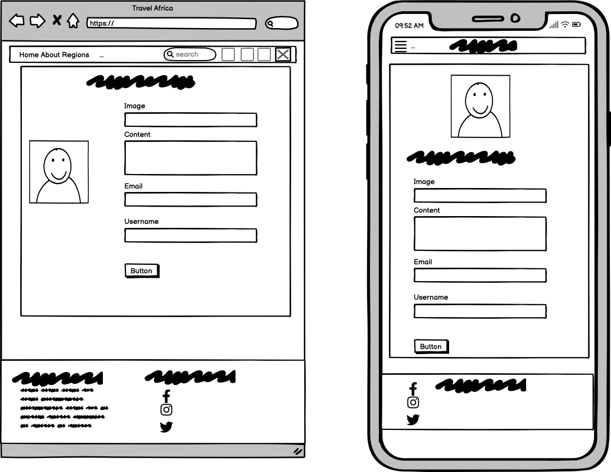

    
Create Blog Post

    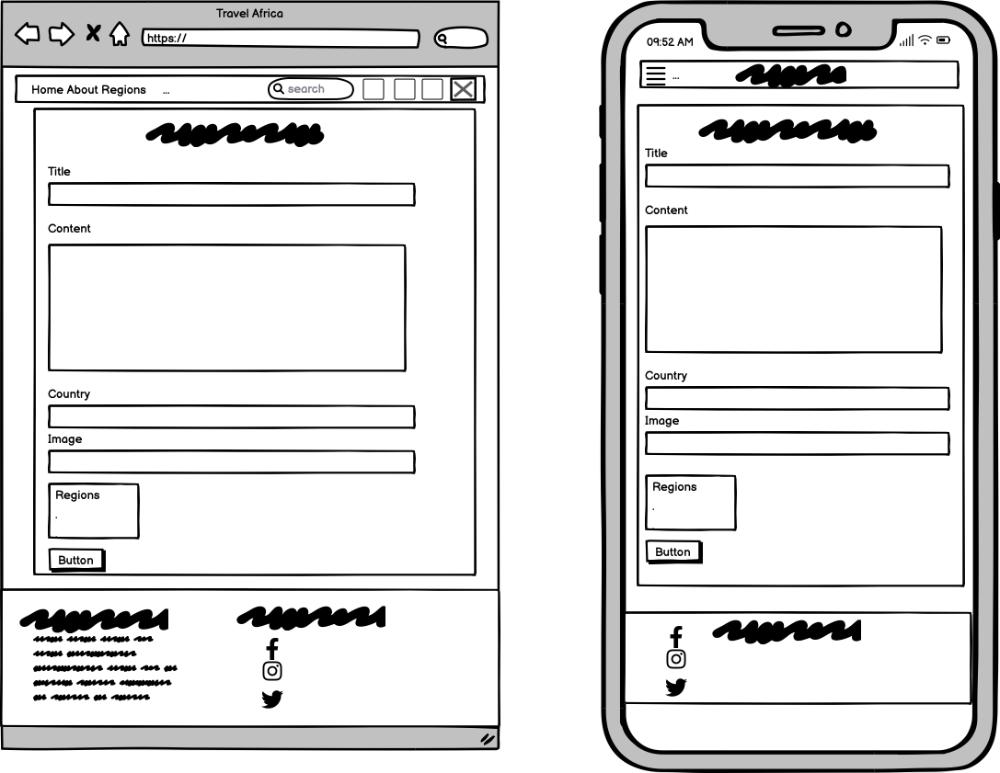

    
Blog Post

    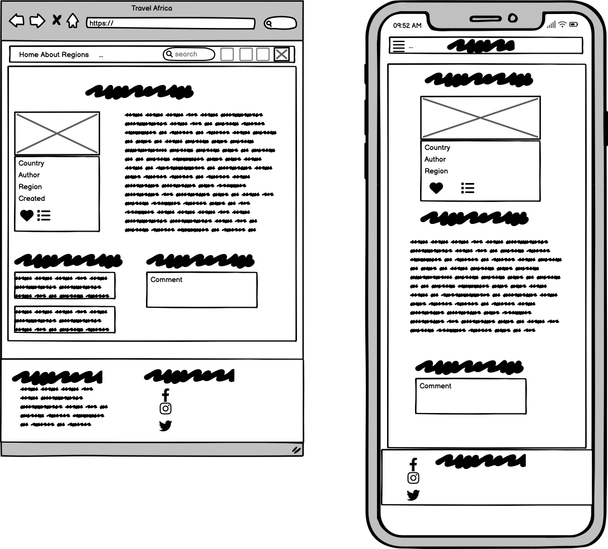

 

## <a name="agile-methodology">Agile methodology</a>

All functionality and development of this project were managed using GitHub which Projects can be found
[here](https://github.com/users/kerstin-w/projects/6)

### <a name="moscow-method-and-story-points">MoSCoW method and story points</a>

To implement agile methodology, the Kanban board and Issues feature on GitHub Projects were utilized. 
6 Epics were created which were then further developed into User Stories. User stories were first created and then prioritized using the MoSCoW method. The points were assigned to each story based on their complexity, amount of work, and repetition using a modified Fibonacci sequence (1, 2, 3, 5, and so on).Each User Story was assigned a classification of `Must Have`, `Should Have`, `Could Have` or `Won't Have`.  In practice some of the User Stories were completed quicker than anticipated and other User Stories took a longer.
The details are as following:

- Epic: Landing Page

    | Issue # | User Story | Prioritisation | Points |
    | :-----------: | :---------: | :-----------: | :-----------: |
    | [#1](https://github.com/kerstin-w/Travel-Africa/issues/1) | As a first-time visitor, I want to know what this site is about immediately so that I can decide whether I will explore further. | Must Have | 3 |
    | [#3](https://github.com/kerstin-w/Travel-Africa/issues/3) | As a Unregistered User I can view a list of posts so that I can select one to read. | Must Have | 2 |
    | [#4](https://github.com/kerstin-w/Travel-Africa/issues/4) | As a Unregistered User I can select a category so that I can only view relevant posts. | Must Have | 2 |
    | [#5](https://github.com/kerstin-w/Travel-Africa/issues/5) | As a Unregistered User I can view a list of highlights posts so that I can select one to read. | Should Have | 1 |
    | [#6](https://github.com/kerstin-w/Travel-Africa/issues/6) | As a Unregistered User I can Create an account so that I can sign in and use of the sites full functionality. | Must Have | 2 |
    | [#28](https://github.com/kerstin-w/Travel-Africa/issues/28) | As a supersuer I want to create a category when needed so that I can manage the site effectively. | Could Have | 1 |

 

- Epic: Search for posts

    | Issue # | User Story | Prioritisation | Points |
    | :-----------: | :---------: | :-----------: | :-----------: |
    | [#13](https://github.com/kerstin-w/Travel-Africa/issues/13) | As a Unregistered User I can search a post by a keyword so that I can try to find posts relative to the keyword. | Could Have | 1 |

 

- Epic: Sign in/out & site authorisation

    | Issue # | User Story | Prioritisation | Points |
    | :-----------: | :---------: | :-----------: | :-----------: |
    | [#6](https://github.com/kerstin-w/Travel-Africa/issues/6) | As a Unregistered User I can Create an account so that I can sign in and use of the sites full functionality. | Must Have | 2 |
    | [#10](https://github.com/kerstin-w/Travel-Africa/issues/10) | As a Registered User I can create a post so that I can share my experiences with other users. | Must Have | 3 |
    | [#14](https://github.com/kerstin-w/Travel-Africa/issues/14) | As a Registered User I can leave a comment on a post so that I can exchange with the author an be involved in a conversation. | Must Have | 3 |
    | [#16](https://github.com/kerstin-w/Travel-Africa/issues/16) | As a Registered User I can like a post so that highlight useful content for other users. | Should Have | 1 |
    | [#18](https://github.com/kerstin-w/Travel-Africa/issues/18) | As a Registered User I can can add a Post to my bucket list so that I can save destinations I want to travel to. | Could Have | 2 |
    | [#26](https://github.com/kerstin-w/Travel-Africa/issues/26) | As a registered user I can rely on the app to log me out automatically so that strangers cannot access my profile in case I am on a public computer. | Could Have | 1 |
    | [#31](https://github.com/kerstin-w/Travel-Africa/issues/31) | As a registered user I want to reset my password so that I can regain access to my account if I forget my password. | Could Have | 1 |
    
 

- Epic: Post Interaction

    | Issue # | User Story | Prioritisation | Points |
    | :-----------: | :---------: | :-----------: | :-----------: |
    | [#14](https://github.com/kerstin-w/Travel-Africa/issues/14) | As a Registered User I can leave a comment on a post so that I can exchange with the author an be involved in a conversation. | Must Have | 3 |
    | [#15](https://github.com/kerstin-w/Travel-Africa/issues/15) | As a Unregistered User I can view comments so that I can read other users feedback. | Must Have | 1 |
    | [#16](https://github.com/kerstin-w/Travel-Africa/issues/16) | As a Registered User I can like a post so that highlight useful content for other users. | Should Have | 1 |
    | [#17](https://github.com/kerstin-w/Travel-Africa/issues/17) | As a Registered User I can receive an email notification if another user commented on my post so that I can engage in a conversation with other users. | Could Have | 1 |
    | [#22](https://github.com/kerstin-w/Travel-Africa/issues/22) | As a Registered User I can delete my comments so that I can control the information that I share. | Must Have | 1 |

 

- Epic: Blog Posts

    | Issue # | User Story | Prioritisation | Points |
    | :-----------: | :---------: | :-----------: | :-----------: |
    | [#3](https://github.com/kerstin-w/Travel-Africa/issues/3) | As a Unregistered User I can view a list of posts so that I can select one to read. | Must Have | 2 |
    | [#10](https://github.com/kerstin-w/Travel-Africa/issues/10) | As a Registered User I can create a post so that I can share my experiences with other users. | Must Have | 3 |
    | [#11](https://github.com/kerstin-w/Travel-Africa/issues/11) | As a Registered User I can edit my posts so that I can keep them current and amend mistakes. | Must Have | 2 |
    | [#12](https://github.com/kerstin-w/Travel-Africa/issues/12) | As a Registered User I can delete my posts so that I can control the information that I share. | Must Have | 1 |
    | [#29](https://github.com/kerstin-w/Travel-Africa/issues/29) | As a supersuer I want to delete content when inappropriate so that I can maintain the site and ensure that only useful or relevant content remains. | Must Have | 2 |

 

- Epic: User Profile 

    | Issue # | User Story | Prioritisation | Points |
    | :-----------: | :---------: | :-----------: | :-----------: |
    | [#6](https://github.com/kerstin-w/Travel-Africa/issues/6) | As a Unregistered User I can Create an account so that I can sign in and use of the sites full functionality. | Must Have | 2 |
    | [#7](https://github.com/kerstin-w/Travel-Africa/issues/7) | As a Registered User I can view my own account so that I can manage my account easily. | Must Have | 1 |
    | [#8](https://github.com/kerstin-w/Travel-Africa/issues/8) | As a Registered User I can Edit/Update my account so that my profile is up to date. | Should Have | 2 |
    | [#9](https://github.com/kerstin-w/Travel-Africa/issues/9) | As a Registered User I can delete my account so that I can remove my footprint from the website if I am no longer active. | Should Have | 1 |
    | [#30](https://github.com/kerstin-w/Travel-Africa/issues/30) | As a superuser I want to block user accounts so that I can ensure only trusted users can access the site. | Should Have | 2 |
    

