# Travel Africa
Travel Africa is a website that celebrates the natural beauty and rich culture of Africa. It is a space where travel enthusiasts and adventurers from all over the world can share their recommendations, and tips for exploring the continent.


# Live Project

[View live project here](https://travel-africa.herokuapp.com/)

## Contents

---

- [User Experience (UX)](#user-experience-ux)
    - [Website Goal](#website-goal)
    - [Target Audience](#target-audience)
    - [User Stories](#user-stories)
- [Design](#design)
  - [Colour Palette](#colour-palette)
  - [Fonts](#fonts)
  - [Images](#images)
  - [Wireframes](#wireframes)
- [Agile methodology](#agile-methodology)
  - [MoSCoW method and story points](#moscow-method-and-story-points)
  - [Iterations](#iterations)
- [Database Model](#database-model)
    - [Database](#database)
    - [Entity Relationship Diagram](#entity-relationship-diagram)
    - [Models](#models)
- [Features](#features)
    - [Implemented Features](#implemented-features)
    - [Future Features](#future-features)
- [Technologies Used](#technologies-used)
    - [Languages](#languages)
    - [Framework](#framework)
    - [Programs](#programs)
- [Testing](#testing)
- [Deployment](#deployment)
- [References & Credit](#references-credit)


---

## <a name="ux">User Experience</a>

### <a name="website-goal">Website Goal</a>

Goals of the Travel Africa blog are: 
- To provide a platform where people can easily share information about Africa
- To inspire people to travel to Africa and explore the continent
- To create a community of like-minded travelers
- To provide valuable information and resources

### <a name="target-audience">Target Audience</a>

- People who love to travel and are interested in exploring the natural beauty of Africa.
- Individuals from different age groups, backgrounds, and nationalities.

### <a name="user-stories">User Stories</a>

- As a first-time visitor,
  - [#1](https://github.com/kerstin-w/Travel-Africa/issues/1) I want to know what this site is about immediately so that I can decide whether I will explore further.
  - [#2](https://github.com/kerstin-w/Travel-Africa/issues/2) I want to navigate pages so that I can understand what types of information I can find.

<br>

- As an unregistered User,
  - [#3](https://github.com/kerstin-w/Travel-Africa/issues/3) I can view a list of posts so that I can select one to read.
  - [#4](https://github.com/kerstin-w/Travel-Africa/issues/4) I can select a category so that I can only view relevant posts.
  - [#5](https://github.com/kerstin-w/Travel-Africa/issues/5) I can view a list of highlights posts so that I can select one to read.
  - [#6](https://github.com/kerstin-w/Travel-Africa/issues/6) I can create an account so that I can sign in and use of the sites full functionality.
  - [#13](https://github.com/kerstin-w/Travel-Africa/issues/13) I can search a post by a keyword so that I can try to find posts relative to the keyword.
  - [#15](https://github.com/kerstin-w/Travel-Africa/issues/15) I can view comments so that I can read other users feedback.

<br>

- As an registered User,
  - [#7](https://github.com/kerstin-w/Travel-Africa/issues/7) I can view my own account so that I can manage my account easily.
  - [#8](https://github.com/kerstin-w/Travel-Africa/issues/8) I can Edit/Update my account so that my profile is up to date.
  - [#9](https://github.com/kerstin-w/Travel-Africa/issues/9) I can delete my account so that I can remove my footprint from the website if I am no longer active.
  - [#10](https://github.com/kerstin-w/Travel-Africa/issues/10) I can create a post so that I can share my experiences with other users.
  - [#11](https://github.com/kerstin-w/Travel-Africa/issues/11) I can edit my posts so that I can keep them current and amend mistake.
  - [#12](https://github.com/kerstin-w/Travel-Africa/issues/12) I can delete my posts so that I can control the information that I share.
  - [#14](https://github.com/kerstin-w/Travel-Africa/issues/14) I can leave a comment on a post so that I can exchange with the author an be involved in a conversation.
  - [#16](https://github.com/kerstin-w/Travel-Africa/issues/16) I can like a post so that highlight useful content for other users.
  - [#17](https://github.com/kerstin-w/Travel-Africa/issues/17) I can receive an email notification if another user commented on my post so that I can engage in a conversation with other users.
  - [#18](https://github.com/kerstin-w/Travel-Africa/issues/18) I can can add a Post to my bucket list so that I can save destinations I want to travel to.
  - [#19](https://github.com/kerstin-w/Travel-Africa/issues/19) I can delete my comments so that I can control the information that I share.
  - [#26](https://github.com/kerstin-w/Travel-Africa/issues/26) I can rely on the app to log me out automatically so that strangers cannot access my profile in case I am on a public computer.
  - [#27](https://github.com/kerstin-w/Travel-Africa/issues/27) I can be routed to a error page in case a page is not found so that I understand the error and click on a link to get back to the homepage.
  - [#31](https://github.com/kerstin-w/Travel-Africa/issues/31) I want to reset my password so that I can regain access to my account if I forget my password.
  
<br>

- As an Superuser,
  - [#28](https://github.com/kerstin-w/Travel-Africa/issues/28) I want to create a category when needed so that I can manage the site effectively.
  - [#29](https://github.com/kerstin-w/Travel-Africa/issues/29) I want to delete content when inappropriate so that I can maintain the site and ensure that only useful or relevant content remains
  - [#30](https://github.com/kerstin-w/Travel-Africa/issues/30) I want to block user accounts so that I can ensure only trusted users can access the site.

<br>

## <a name="desgin">Design</a>

### <a name="colour-palette">Colour Palette</a>

To create a colour palette, I used [_Mycolor.space_](https://mycolor.space/). The color palette consists of deep blues meant to evoke the sea and sky, warm yellows and oranges meant to evoke the sun, and a skin tone-like color that can be associated with the various cultures of Africa. The palette also includes a mellow white that reflects the natural and unspoiled beauty of African landscapes and wildlife.


After testing the accessibility, I changed the lighter blue  `#686E9F` to a slightly darker blue  `#5c639e` to achieve a better contrast between the background and the text.

### <a name="fonts">Fonts</a>
[_Sourced via Google Fonts._](https://fonts.google.com/)

**Heading:** 
- For Headings, "Waiting for the Sunrise" font was selected, which has a handwritten and adventurous feel and complements the theme of travel and exploration.

**Body:** 
- “Roboto”, is a clean and modern font that is easy to read, making it a good choice for body text and enhancing readability for the readers. 

### <a name="images">Images</a> 

[*Sourced via Pexels.*](https://www.pexels.com/)

Images are an important aspect of the Travel Blog, as they help to enhance the users's experience and provide a visual representation of the destinations and experiences being discussed. They make the content more engaging and visually appealing. All images I used as blog creater, were compressed with [TinyPNG](https://tinypng.com/). The downside is, that I cannot control the size of pictures uploaded by the user and their effect on the loading time. 

* The home page includes a carousel in the Hero banner, that shows three images of Africa to draw the user's immediate attention to Africa.

* Users can upload a picture of the destination in their blog post, which will be featured on the blog post page, as well as on the post list page. 

* Users can upload a picture of themselves in their profile to make it a more personalized experience.

### <a name="wireframes">Wireframes</a> 

<details>
    <summary>Homepage</summary>
    
</details>

<details>
    <summary>About Page</summary>
    
</details>

<details>
    <summary>Regions</summary>
    
</details>

<details>
    <summary>Search Results</summary>
    
</details>

<details>
    <summary>Register & Login</summary>
    
</details>

<details>
    <summary>Profile (View of other registered users)</summary>
    
</details>

<details>
    <summary>Profile (Own View)</summary>
    
</details>

<details>
    <summary>Edit Profile</summary>
    
</details>

<details>
    <summary>Create Blog Post</summary>
    
</details>

<details>
    <summary>Blog Post</summary>
    
</details>

<br>

## <a name="agile-methodology">Agile methodology</a>

All functionality and development of this project were managed using GitHub which Projects can be found
[here](https://github.com/users/kerstin-w/projects/6)

### <a name="moscow-method-and-story-points">MoSCoW method and story points</a>

To implement agile methodology, the Kanban board and Issues feature on GitHub Projects were utilized. 
6 Epics were created which were then further developed into User Stories. User stories were first created and then prioritized using the MoSCoW method. The points were assigned to each story based on their complexity, amount of work, and repetition using a modified Fibonacci sequence (1, 2, 3, 5, and so on). Each User Story was assigned a classification of `Must Have`, `Should Have`, `Could Have` or `Won't Have`.  In practice, some of the User Stories were completed quicker than anticipated and other User Stories took longer.
The details are as follows:

- Epic: Landing Page

    | Issue # | User Story | Prioritisation | Points |
    | :-----------: | :---------: | :-----------: | :-----------: |
    | [#1](https://github.com/kerstin-w/Travel-Africa/issues/1) | As a first-time visitor, I want to know what this site is about immediately so that I can decide whether I will explore further. | Must Have | 3 |
    | [#3](https://github.com/kerstin-w/Travel-Africa/issues/3) | As a Unregistered User I can view a list of posts so that I can select one to read. | Must Have | 2 |
    | [#4](https://github.com/kerstin-w/Travel-Africa/issues/4) | As a Unregistered User I can select a category so that I can only view relevant posts. | Must Have | 2 |
    | [#5](https://github.com/kerstin-w/Travel-Africa/issues/5) | As a Unregistered User I can view a list of highlights posts so that I can select one to read. | Should Have | 1 |
    | [#6](https://github.com/kerstin-w/Travel-Africa/issues/6) | As a Unregistered User I can Create an account so that I can sign in and use of the sites full functionality. | Must Have | 2 |
    | [#28](https://github.com/kerstin-w/Travel-Africa/issues/28) | As a supersuer I want to create a category when needed so that I can manage the site effectively. | Could Have | 1 |

<br>

- Epic: Search for posts

    | Issue # | User Story | Prioritisation | Points |
    | :-----------: | :---------: | :-----------: | :-----------: |
    | [#13](https://github.com/kerstin-w/Travel-Africa/issues/13) | As a Unregistered User I can search a post by a keyword so that I can try to find posts relative to the keyword. | Could Have | 1 |

<br>

- Epic: Sign in/out & site authorisation

    | Issue # | User Story | Prioritisation | Points |
    | :-----------: | :---------: | :-----------: | :-----------: |
    | [#6](https://github.com/kerstin-w/Travel-Africa/issues/6) | As a Unregistered User I can Create an account so that I can sign in and use of the sites full functionality. | Must Have | 2 |
    | [#10](https://github.com/kerstin-w/Travel-Africa/issues/10) | As a Registered User I can create a post so that I can share my experiences with other users. | Must Have | 3 |
    | [#14](https://github.com/kerstin-w/Travel-Africa/issues/14) | As a Registered User I can leave a comment on a post so that I can exchange with the author an be involved in a conversation. | Must Have | 3 |
    | [#16](https://github.com/kerstin-w/Travel-Africa/issues/16) | As a Registered User I can like a post so that highlight useful content for other users. | Should Have | 1 |
    | [#18](https://github.com/kerstin-w/Travel-Africa/issues/18) | As a Registered User I can can add a Post to my bucket list so that I can save destinations I want to travel to. | Could Have | 2 |
    | [#26](https://github.com/kerstin-w/Travel-Africa/issues/26) | As a registered user I can rely on the app to log me out automatically so that strangers cannot access my profile in case I am on a public computer. | Could Have | 1 |
    | [#31](https://github.com/kerstin-w/Travel-Africa/issues/31) | As a registered user I want to reset my password so that I can regain access to my account if I forget my password. | Could Have | 1 |
    
<br>

- Epic: Post Interaction

    | Issue # | User Story | Prioritisation | Points |
    | :-----------: | :---------: | :-----------: | :-----------: |
    | [#14](https://github.com/kerstin-w/Travel-Africa/issues/14) | As a Registered User I can leave a comment on a post so that I can exchange with the author an be involved in a conversation. | Must Have | 3 |
    | [#15](https://github.com/kerstin-w/Travel-Africa/issues/15) | As a Unregistered User I can view comments so that I can read other users feedback. | Must Have | 1 |
    | [#16](https://github.com/kerstin-w/Travel-Africa/issues/16) | As a Registered User I can like a post so that highlight useful content for other users. | Should Have | 1 |
    | [#17](https://github.com/kerstin-w/Travel-Africa/issues/17) | As a Registered User I can receive an email notification if another user commented on my post so that I can engage in a conversation with other users. | Could Have | 1 |
    | [#22](https://github.com/kerstin-w/Travel-Africa/issues/22) | As a Registered User I can delete my comments so that I can control the information that I share. | Must Have | 1 |

<br>

- Epic: Blog Posts

    | Issue # | User Story | Prioritisation | Points |
    | :-----------: | :---------: | :-----------: | :-----------: |
    | [#3](https://github.com/kerstin-w/Travel-Africa/issues/3) | As a Unregistered User I can view a list of posts so that I can select one to read. | Must Have | 2 |
    | [#10](https://github.com/kerstin-w/Travel-Africa/issues/10) | As a Registered User I can create a post so that I can share my experiences with other users. | Must Have | 3 |
    | [#11](https://github.com/kerstin-w/Travel-Africa/issues/11) | As a Registered User I can edit my posts so that I can keep them current and amend mistakes. | Must Have | 2 |
    | [#12](https://github.com/kerstin-w/Travel-Africa/issues/12) | As a Registered User I can delete my posts so that I can control the information that I share. | Must Have | 1 |
    | [#29](https://github.com/kerstin-w/Travel-Africa/issues/29) | As a supersuer I want to delete content when inappropriate so that I can maintain the site and ensure that only useful or relevant content remains. | Must Have | 2 |

<br>

- Epic: User Profile 

    | Issue # | User Story | Prioritisation | Points |
    | :-----------: | :---------: | :-----------: | :-----------: |
    | [#6](https://github.com/kerstin-w/Travel-Africa/issues/6) | As a Unregistered User I can Create an account so that I can sign in and use of the sites full functionality. | Must Have | 2 |
    | [#7](https://github.com/kerstin-w/Travel-Africa/issues/7) | As a Registered User I can view my own account so that I can manage my account easily. | Must Have | 1 |
    | [#8](https://github.com/kerstin-w/Travel-Africa/issues/8) | As a Registered User I can Edit/Update my account so that my profile is up to date. | Should Have | 2 |
    | [#9](https://github.com/kerstin-w/Travel-Africa/issues/9) | As a Registered User I can delete my account so that I can remove my footprint from the website if I am no longer active. | Should Have | 1 |
    | [#30](https://github.com/kerstin-w/Travel-Africa/issues/30) | As a superuser I want to block user accounts so that I can ensure only trusted users can access the site. | Should Have | 2 |
    
<br>

### <a name="iterations">Iterations</a>

The project was carried out over 4 iterations and each iteration lasted 3-4 days.

- Iteration 1 (Closed points 10 / Planned points 10)

    

- Iteration 2 (Closed points 10 / Planned points 10)

    

- Iteration 3 (Closed points 9 / Planned points 10)

    

- Iteration 4 (Closed points 10 / Planned points 10)

    

<br>

## <a name="database-model">Database Model</a>

### <a name="database">Database</a>

[PostgreSQL](https://www.postgresql.org/) was used for the main database from the earliest stage of development.

The database has been switched to [ElephantSQL](https://www.elephantsql.com/).

<br>

### <a name="entity-relationship-diagram">Entity Relationship Diagram</a>


<br>

### <a name="models">Models</a>

- Profile

    Profile model inherits the Django-allauth's. I expanded it with the image and description which are optional and the date of creation. The Django signals were used to create a profile for the newly registered user.

    | Field Name | Type | Arguments |
    | :--------: | :--: | :-------: |
    | id | BigAutoField | primary_key=True |
    | user | OneToOneField(User) | null=True, on_delete=models.CASCADE |
    | image | CloudinaryField | "image", default="placeholder" |
    | description | TextField | max_length=200, blank=True, null=True |
    | created_on | DateTimeField | auto_now_add=True |

    - Methods

        ```
        def __str__(self):
            return self.user.username
        ```
- Category

    The Catgeory model contains a title and a slug to create a more informative URL.

    | Field Name | Type | Arguments |
    | :--------: | :--: | :-------: |
    | title | CharField | max_length=30, unique=True |
    | slug | SlugField | max_length=30, unique=True, null=False |

    - Metadata

        ```
        class Meta:
            ordering = ('title',)
            verbose_name_plural = 'Categories'
        ```

    - Methods

        ```
        def __str__(self):
            return self.title
        ```

- Post

    The Post model contains all valuable fields for the blogpost. For the title, the CaseInsensitiveFieldMixin was used for validation purposes. 

    | Field Name | Type | Arguments |
    | :--------: | :--: | :-------: |
    | id | BigAutoField | primary_key=True |
    | title | CaseInsensitiveCharField | max_length=100, unique=True |
    | slug | SlugField | max_length=100, unique=True, null=False |
    | author | ForeignKey| User, on_delete=models.CASCADE, related_name="blog_posts" |
    | created_on | DateTimeField | auto_now_add=True |
    | content | TextField | verbose_name='Text' |
    | country | CharField | max_length=100 |
    | featured_image | CloudinaryField | 'image', default='placeholder' |
    | regions | ForeignKey | Category, on_delete=models.CASCADE, related_name="blog_posts" |
    | status | IntegerField | choices=STATUS, default=0 |
    | likes | ManyToManyField | User, related_name='blogpost_like', blank=True |
    | featured | BooleanField | default=False |

    - Metadata

    ```
    class Meta:
        ordering = ['-created_on']
    ```

    - Methods

    ```
    def __str__(self):
        return self.title

    def get_absolute_url(self):
        return reverse('post_detail', kwargs={'slug': self.slug})
    ```

- Comment

    | Field Name | Type | Arguments |
    | :--------: | :--: | :-------: |
    | id | BigAutoField | primary_key=True |
    | post | ForeignKey | Post, on_delete=models.CASCADE, related_name="comments" |
    | name | ForeignKey | User, on_delete=models.CASCADE, related_name='comments' |
    | body | TextField | max_length=255 |
    | created_on | DateTimeField | auto_now_add=True |
    | approved | BooleanField | default=False |
    | profile | ForeignKey | Profile, on_delete=models.CASCADE, null=True, blank=True, related_name='comments' |

    - Metadata

    ```
    class Meta:
        ordering = ['created_on']
    ```

    - Methods

    ```
    def __str__(self):
        return f"Comment {self.body} by {self.name}"
    ```

- BucketList

    | Field Name | Type | Arguments |
    | :--------: | :--: | :-------: |
    | user | OneToOneField | User, on_delete=models.CASCADE |
    | post | ManyToManyField | Post, related_name='bucketlist_post', blank=True |
    | added_on | DateTimeField | auto_now_add=True |


    - Methods

    ```
    def __str__(self):
        return f"{self.user.username}'s Bucket List"
    ```
<br>

## <a name="features">Features</a>

### <a name="implemented-features">Implemented Features</a>

### Navbar
- Navbar items **Home, About, Regions, Logo, Search, Register and Login** are available for unregistered/not logged in users.
- Navbar items **Home, About, Regions, Logo, Search, Bucket List, Write Post, Logout and Profile** are available for registered users.
- The Navbar is fixed to the top of the screen even when the user is scrolling down the page to allow easier navigation.
- The logo is linked to the Homepage and each menu item is linked to each page respectively to allow easier navigation.
- The search bar allows users to easily search for a keyword they are looking for.
- The navigation menu collapses on small/medium devices to optimise the menu for smaller screen sizes.

<details>
    <summary>Navbar for unregistered/not logged in users</summary>

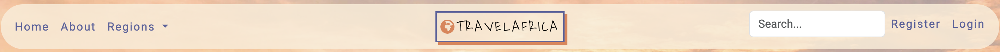


</details>

<details>
    <summary>Navbar logged in users</summary>


</details>

<br>

### Home Page

- The hero image welcomes the user with a short message, letting the user know what the website is about. These are 3 carousel images with a button. When the button is pressed, it brings the user to the Post page (all posts).


<br>

### Home Page - Highlights

- In the highlighted posts, users can see a selection of 6 blog posts. These posts are selected by the admin by clicking the featured box in the post database.

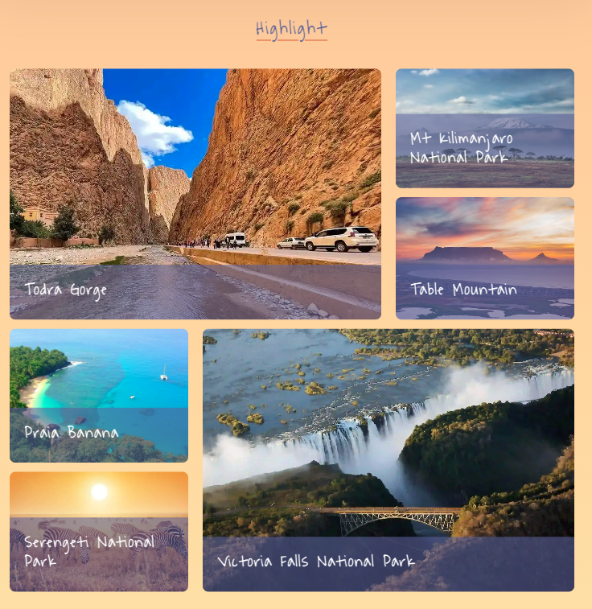

<br>

### Footer
- All footer items are available to both unregistered and registered users.


<br>

### About Page

- The About Page gives, users information about the Travel Africa website. It introduces users to the website. It also details the main purpose and goal of the blog.


<br>

### Regions Page

- You can either select to sell all Posts or just the Posts of the selected region. 
- A list with posts according to the selection will be displayed. 
- All Post Cards show a picture of the post, the date the post was created, a badge of the region, title, shortened description and an Explore Button.
- All users can see the number of comments and likes a post already received. 
- Pagination is implemented and each site shows a total of 8 posts.


### Post Detail Page

- The Post Detail Page shows all information (title, country, author, region, created on, description) of a certain Post.
- The behavior is different for users who are not logged in and users who are logged in. 

<br>

<details>
    <summary>Post Detail Page unregistered/not logged in users</summary>


</details>

<br>

- Users who are not logged in can see all information on a post.
- Users who are not logged in can see the number of likes, but cannot interact with it.
- Users who are not logged in can only read comments but not write them.

<br>

<details>
    <summary>Post Detail Page logged in users</summary>


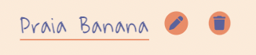


</details>

<br>

- Users who are logged in can see all information on a post.
- Users who are logged in can click on the little profile image of the author and view the author profile page.
- Users who are logged in can see the number of likes and like a post.
- Users who are logged in can add the post to their bucket list. The bucket list button is disabled once a post is added to the bucket list.
- Users who are logged in can add, read and write comments. 
- The author and the superuser also have the option to edit and delete a post. These buttons are only displayed to author and superuser.

<br>

### Create and Edit a Post

- Registered users can write a post by entering all information into the form.
- The form will be validated and if the input is not valid, or data is missing the user will see an appropriate message on the screen.


<br>

### User Profile

- Registered user can click on the little profile image of the author to see the Profile picture.
- The Owner of the profile will see a slightly different Profile Page than other registered users.

<br>

- Users can see information about the other user: a short description of the person, member since
- Users can see a list of posts written by the profile user

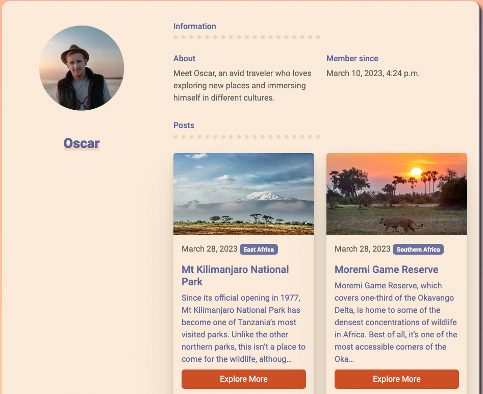

<br>

- The profile owner can see all information as well.
- The profile owner has the option to edit or delete the profile.
- The profile owner can click on the Posts button to see all posts written.
- The profile owner can click on the comments button to see all comments received. 

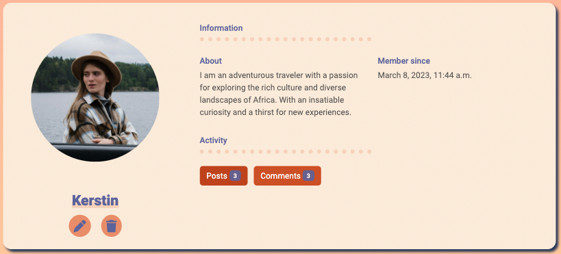
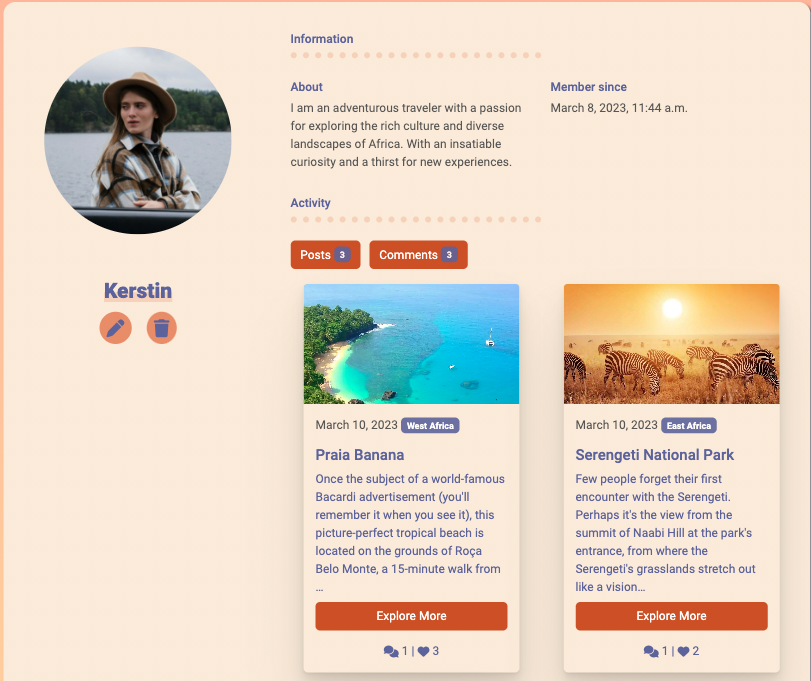


<br>

### Edit Profile

- The profile owner can update their own profile by filling out the form, or adding information.
- The from is validated and if the input is not valid, or data is missing the user will see an appropriate message on the screen.
- The user also has the option to change their password.

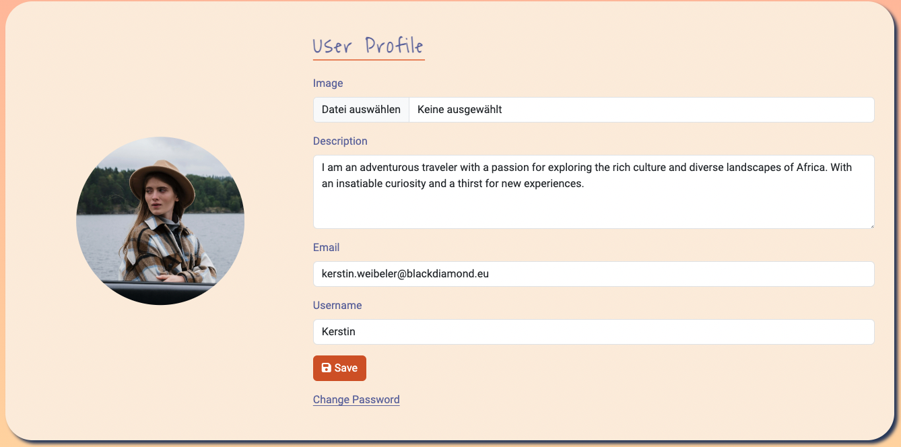


<br>

### Bucket List

- In the bucket list a user can revisit all post that were saved by the user.
- This gives a user the option to create a list of places to visit, or just to be able to read the post again and not lose track of it.
- By clicking on a post title the user will be forwarded to the Post Page.
- The the user can remove a post from the bucket list by clicking on the bin icon. 


<br>

### Search

- The users can search by inputting a keyword in the search tool. This allows the user to try and find posts they are looking for.
- On the Search Results Page, users can see the posts found by their search.

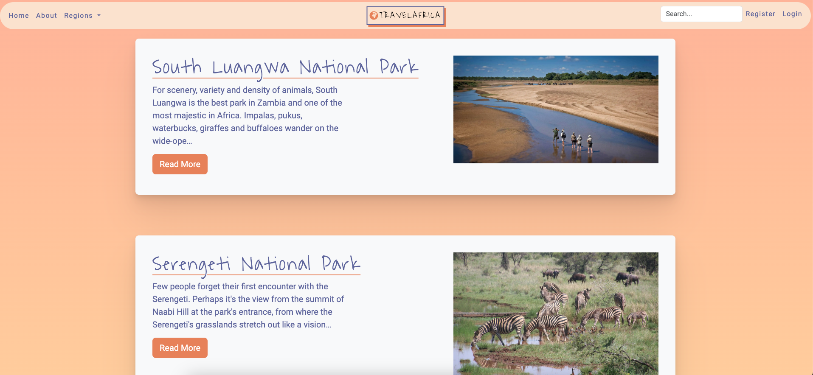

<br>

### Sign Up

- Users who are not registered, yet can sign up for Travel Africa. 
- The user needs to enter email, username and password.
- Email and username need to be unique. 
- The form will be validated and if the input is not valid, or data is missing the user will see an appropriate message on the screen.
- Once the user enters all data a confirmation email will be sent to the users email address to confirm the email address. 
- Afterwards the user can log into the page 


### Sign In

- Users who are already registered can log into their account.
- The form will be validated and if the input is not valid, or data is missing the user will see an appropriate message on the screen.
- If the user forgot the password, it is also given the option to reset the password. 
- Afterwards the user will receive an email with a link to reset the password and enter a new password.

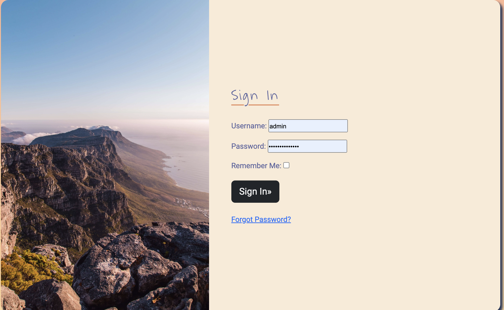

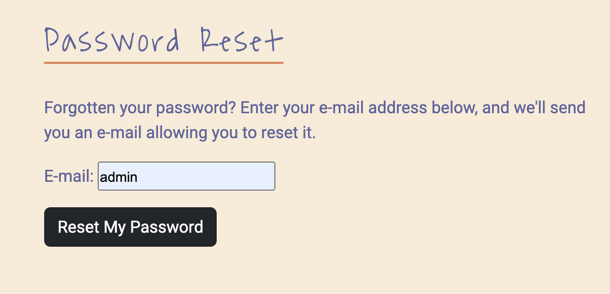
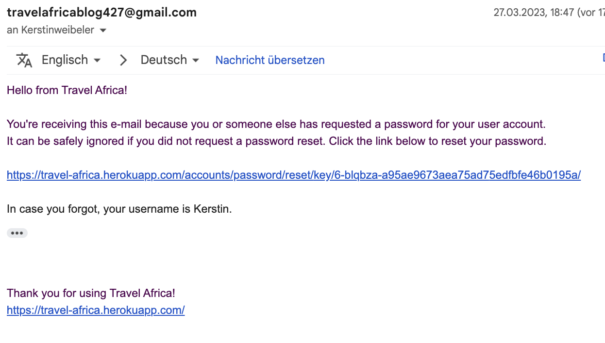

<br>

### <a name="future-features">Future Features</a>

- This project was built to produce a minimum viable product. Nevertheless there are still some features to be implemented in the future. See [here](https://github.com/kerstin-w/Travel-Africa/issues?q=is%3Aopen+is%3Aissue)

#### [#34](https://github.com/kerstin-w/Travel-Africa/issues/34) - Sending Direct Messages
#### [#33](https://github.com/kerstin-w/Travel-Africa/issues/33) - Welcome Email
#### [#32](https://github.com/kerstin-w/Travel-Africa/issues/32) - Social Login
#### Image CDN:
- Since the application allows users to upload images and does not limit the size of the image, this will cause losses and fluctuations in site performance. Therefore, a CDN should ensure that a suitable size of the image is transmitted to keep loading time as low as possible. 

<br>

## <a name="technologies-used">Technologies Used</a>

### <a name="languages">Languages</a>

- [Python](https://www.python.org/)
- [HTML](https://en.wikipedia.org/wiki/HTML) with [Jinja](https://jinja.palletsprojects.com/en/3.1.x/)
- [CSS](https://en.wikipedia.org/wiki/CSS) 
- [JavaScript](https://en.wikipedia.org/wiki/JavaScript) & ( [jQuery](https://jquery.com/) )


### <a name="framework">Framework</a>

- [Django](https://www.djangoproject.com/)
- [Bootstrap](https://getbootstrap.com/)

#### Django Packages

* [Gunicorn](https://gunicorn.org/)- was used as the server for Heroku
* [Cloudinary](https://cloudinary.com/) - was used to host the static files and media
* [Dj_database_url](https://pypi.org/project/dj-database-url/) - was used to parse the database URL from the environment variables in Heroku
* [Psycopg2](https://pypi.org/project/psycopg2/) - was used as an adaptor for Python and PostgreSQL databases
* [Summernote](https://summernote.org/) - was used as a text editor
* [Allauth](https://django-allauth.readthedocs.io/en/latest/installation.html) - was used for authentication, registration, account management
* [Crispy Forms](https://django-crispy-forms.readthedocs.io/en/latest/) - was used to style the forms
* [Case Insensitive Model Field](https://pypi.org/project/django-case-insensitive-field/) - was used to make the Post Title Field case insensitive for validation purposes
* [Session Time Out](https://pypi.org/project/django-session-timeout/) - was used to expire a User Session

### <a name="programs">Programs</a>

- [Balsamiq](https://balsamiq.com/) - was used to create the wireframes.
- [Chrome DevTools](https://developer.chrome.com/docs/devtools/) - was used to view the site's styling, debug during development and check runtime performance.
- [Cloudinary](https://cloudinary.com/) - was used to store static files.
- [Color Space](https://mycolor.space/) - was used to generate the colour plaette.
- [Diagrams.net](https://app.diagrams.net/) - was used to create the ERD.
- [Favicon.io](https://favicon.io/) - was used to create the favicon.
- [Font Awesome](https://fontawesome.com/) - was used for the icons.
- [GitHub](https://github.com/) - was used to store and deploy the project's code.
- [Gitpod](https://www.gitpod.io/) - was used to develop and test my code.
- [Google Fonts](https://fonts.google.com/) - was used to import Fonts to the style.css file.
- [Heroku](https://heroku.com/) - was initially used to deploy the project.
- [Tiny PNG](https://tinypng.com/) - was used to compress pictures.
- [Visual Studio Code](https://code.visualstudio.com/) - was used to edit my code.

<br>

## <a name="testing">Testing</a>

See [TESTING.md](TESTING.md) for an overview of website testing and debugging.

## <a name="#deployment">Deployment</a>

The project has been developed using [Gitpod](https://gitpod.io/) and [GitHub](https://github.com/). The project was regularly committed to GitHub during the initial development phase.

This project was created through [GitHub](https://github.com/):
1. Locating repository, clicking on the "New" button.
2. Selecting the relevant template: [Template](https://github.com/Code-Institute-Org/gitpod-full-template)
3. Adding the repository name "Travel-Africa".
4. Clicking the button "Create repository".

## Creating the Django app

1. In **Gitpod** open a new terminal to start a new Django App
2. Install **Django and gunicorn**: `pip3 install django gunicorn`
3. Install supporting **database libraries** `dj_database_url` and `psycopg2` library: `pip3 install dj_database_url psycopg2`
4. Create file for **requirements**: in the terminal window type `pip freeze --local > requirements.txt`
5. Create **project**: in the terminal window type `django-admin startproject project_name`
6. Create **app**: in the terminal window type `python3 manage.py startapp app_name`
7. Add app to the list of installed apps in `settings.py` file: `app_name`
8. Migrate changes: in the terminal window type `python3 manage.py migrate`
9. Run the server: in the terminal window type `python3 manage.py runserver`

## Deployment

- This site was deployed by completing the following steps:

**In GitPod**

1. Create a file `env.py` on the top-level directory
2. Add `import os` at the top of `env.py`
3. Cut the default `SECRET_KEY` value from the project settings file and paste it into the value of the following variable: `os.environ['SECRET_KEY'] = 'secretKey'``
4. Create a `Procfile` on the top-level directory and add the following line of code: `web: gunicorn krie.wsgi.`
5. Update list of dependencies to the requirements.txt file: `pip3 freeze --local > requirements.txt`

**In Heroku**

1. Log in to [Heroku](https://heroku.com) or create an account
2. On the main page click the button labelled `New` in the top right corner and from the drop-down menu select `Create New`
App
3. Enter a unique app name
4. Select your region
5. Click on the `Create App` button
6. Click in resources and select Heroku Postgres database
7. Click Reveal Config Vars and add a new record with `PORT`
7. Click Reveal Config Vars and add a new record with `SECRET_KEY`
8. Click Reveal Config Vars and add a new record with the `CLOUDINARY_URL`
9. Click Reveal Config Vars and add a new record with the `DISABLE_COLLECTSTATIC = 1`
10. Scroll down to the Buildpack section click Add Buildpack select `python` and click Save Changes

**In GitPod**

1. Connect the POSTGRES database by setting DATABASES in settings.py to the following, where database_url is as per the config vars in Heroku settings:
````
DATABASES = {
        'default': dj_database_url.parse(database_url)
    }
````
2. Run `python3 manage.py showmigrations` at the terminal to show migrations to be applied to the new POSTGRES database.
3. Run `python3 manage.py migrate --plan` at the terminal to check the migrations.
4. Run `python3 manage.py migrate` at the terminal to apply the migrations to the new POSTGRES database.
5. Add Heroku app name and localhost to `ALLOWED_HOSTS`.

**Im Heroku**
1. Scroll to the top of the page and choose the Deploy tab
2. Select Github as the deployment method
3. Confirm you want to connect to GitHub
4. Search for the repository name and click the connect button
5. Scroll to the bottom of the deploy page and select the preferred deployment type
6. Click either Enable Automatic Deploys for automatic deployment when you push updates to Github

## Final Deployment 

1. When development is complete change the debug setting to: `DEBUG = False` in settings.py
2. In this project the summernote editor was used so for this to work in Heroku add: `X_FRAME_OPTIONS = SAMEORIGIN `to
   settings.py.
3. In Heroku settings, delete the config vars for `DISABLE_COLLECTSTATIC = 1`
4. Make sure all Config Vars for `DATABASE_URL`, `EMAIL_HOST_PASSWORD`, `EMAIL_HOST_USER` are added.

<details>
<summary>To Fork the project:</summary>

1. Go to the [Project Code Repository Location](https://github.com/kerstin-w/Travel-Africa) on [GitHub](https://github.com/).
2. In the top-right corner of the page, click *Fork*.  

</details>

<details>
<summary>To Clone the project:</summary>

1. Go to the [Project Code Repository Location](https://github.com/kerstin-w/Travel-Africa) on [GitHub](https://github.com/).
2. You will be provided with three options to choose from, HTTPS, SSH or GitHub CLI, click the clipboard icon in order
to copy the URL
3. Once you click the button the fork will be in your repository
4. Open a new terminal
5. Change the current working directory to the location that you want the cloned directory
6. Type `git clone` and paste the URL copied in step 2
7. Press `Enter` and the project is cloned

</details>

## <a name="#references-credit">References & Credit</a>

### Media & Fonts

- [tiny.png](https://tinypng.com/): Used to compress media files
- [Font Awesome](https://fontawesome.com/): Resource for icons
- [Google Fonts](https://fonts.google.com): Used as font library
- [RealFaviconGenerator](https://realfavicongenerator.net/): Used to create a Favicon
- [Pexels](https://www.pexels.com/) & [Lonely Planet](https://www.lonelyplanet.de/): Resources for images
- [Dev.to](https://dev.to/shubhamjain/how-to-create-marker-highlight-effect-in-css-be4): Used for SVG Brush effect

### Code

- [Django 3.2 documentation](https://docs.djangoproject.com/en/3.2/): I highly relied upon the Django documentation throughout the project.
- [django-allauth documentation](https://django-allauth.readthedocs.io/en/latest/installation.html): I relied upon the Django Allauth documentation for user authentication, registration and user management.
- [Django-crispy documentation](https://django-crispy-forms.readthedocs.io/en/latest/): As source to handle forms.
- [Summernote](https://summernote.org/) & [Summernote GitHub](https://github.com/summernote/summernote): As source for Summernote Editor configuration.
- [Forgepackages](https://www.forgepackages.com/guides/page-titles/): As source for dynamic page titles.
- [Simpleisbetterthancomplex](https://simpleisbetterthancomplex.com/tutorial/2017/02/06/how-to-implement-case-insensitive-username.html): As source to ensure case insesitvity for username.
- [Cloudwithdjango](https://www.cloudwithdjango.com/django-shorts-3-sending-emails/): As source for sending emails.
- [Cloudwithdjango](https://www.cloudwithdjango.com/adding-a-session-timeout-in-django/): As source for Session Timeout settings.
- [Betterprogramming](https://betterprogramming.pub/django-quick-tips-context-processors-da74f887f1fc): As source for Context Processors.
- [Stackoverflow](https://stackoverflow.com/questions/18424260/django-serving-robots-txt-efficiently): As source how to wire up a robots.txt.

### Content

All content provided in Blog Posts was taken from [Lonely Planet](https://www.lonelyplanet.de/)