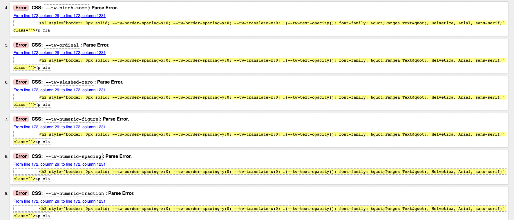
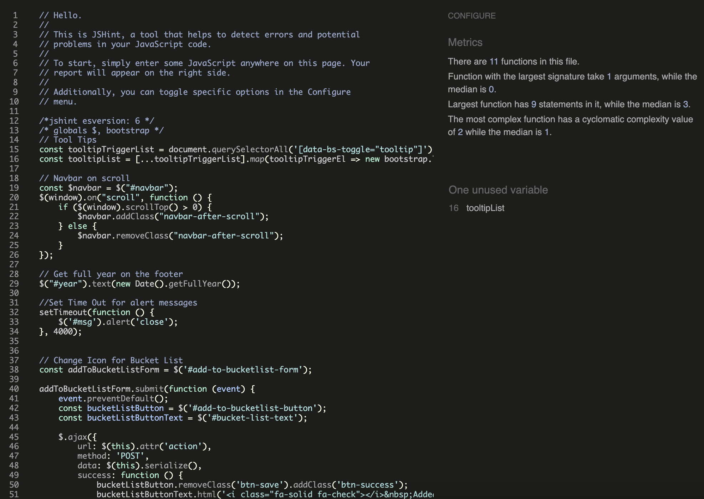

# Testing

## Contents

- [Manual Testing](#manual-testing)
- [Automated Testing](#automated-testing)
- [User Stories Testing](#user-stories-testing)
- [Validator Testing](#validator-testing)
  - [HTML](#html)
  - [CSS](#css)
  - [JS](#js)
  - [Python](#python)
- [LightHouse](#lighthouse)
  - [Destop Results](#desktop-results)
  - [Mobile Results](#mobile-results)
- [Browser Compatibility](#browser-compatibility)
- [Responsivity](#responsivity)
- [Issues/ Bugs Found & Resolved](#issues-bugs)
- [Unresolved](#unresolved)

---

## <a name="automated-testing">Automated Testing</a>

Python **Automated Unit Testing** was implemented using the [Django Unit Testing](https://docs.djangoproject.com/en/3.2/topics/testing/overview/) framework.  
**Unit Tests** have been written to cover all **Forms**, **Models**, **Views**, **Admin**, **Context-Processors** and **Fields**.
I implemented unit testing only at the end of the project, because it was not a mandatory requirement. However, during testing I realized the importance of implementing unit testing from the start of a project in order to ensure the functionality of the code permanently during the development process.
A total of **171** **Unit Tests** have been written. All **171** tests run successfully without errors or warnings.   

<details>
    <summary>Coverage Automated Testing</summary>
    
    
</details>

<br>

## <a name="user-stories-testing">User Stories Testing</a>

### As a first-time visitor,
  - [#1](https://github.com/kerstin-w/Travel-Africa/issues/1) I want to know what this site is about immediately so that I can decide whether I will explore further.

This was achieved with a nice hero banner, asking the user to explore the blog about Africa.


  - [#2](https://github.com/kerstin-w/Travel-Africa/issues/2) I want to navigate pages so that I can understand what types of information I can find.

  This was achieved with a navbar which is fully responsive and functionality has been tested and works as expected.
  

<br>

### As an unregistered User,
  - [#3](https://github.com/kerstin-w/Travel-Africa/issues/3) I can view a list of posts so that I can select one to read.

    In the navbar the user can select, wether to see a list of all post or post of a certain region. Afterwards a list of posts will be displayed and the user can select a post to read.

    

  - [#4](https://github.com/kerstin-w/Travel-Africa/issues/4) I can select a category so that I can only view relevant posts.
    
    In the navbar the user can select, wether to see a list of all post or post of a certain region. Once a certain category was selected only posts of this category will be displayed. When creating a post, the auther has to select a region in order for the categorization to work. 

    This was achieved with a navbar which is fully responsive and functionality has been tested and works as expected.
    
    

  - [#5](https://github.com/kerstin-w/Travel-Africa/issues/5) I can view a list of highlights posts so that I can select one to read.

    On the Home Page the user has the option to select 1 of 6 featured posts. The admin user can select featured posts either in the admin panel or on the post update page.

    
    

  - [#6](https://github.com/kerstin-w/Travel-Africa/issues/6) I can create an account so that I can sign in and use of the sites full functionality.

    From the navbar the user can select **Register** to create a a user account. Afterwards the user is able to use all features, create posts, like post, user the bucket list and comment on posts.

    

  - [#13](https://github.com/kerstin-w/Travel-Africa/issues/13) I can search a post by a keyword so that I can try to find posts relative to the keyword.

    From the navbar the user can use the search function and enter a keyword. If the keywords was found in one of the post titles or countries those related posts will be displayed as search result.
    
    

  - [#15](https://github.com/kerstin-w/Travel-Africa/issues/15) I can view comments so that I can read other users feedback.

<br>

- As an registered User,
  - [#7](https://github.com/kerstin-w/Travel-Africa/issues/7) I can view my own account so that I can manage my account easily.
  - [#8](https://github.com/kerstin-w/Travel-Africa/issues/8) I can Edit/Update my account so that my profile is up to date.
  - [#9](https://github.com/kerstin-w/Travel-Africa/issues/9) I can delete my account so that I can remove my footprint from the website if I am no longer active.
  - [#10](https://github.com/kerstin-w/Travel-Africa/issues/10) I can create a post so that I can share my experiences with other users.
  - [#11](https://github.com/kerstin-w/Travel-Africa/issues/11) I can edit my posts so that I can keep them current and amend mistake.
  - [#12](https://github.com/kerstin-w/Travel-Africa/issues/12) I can delete my posts so that I can control the information that I share.
  - [#14](https://github.com/kerstin-w/Travel-Africa/issues/14) I can leave a comment on a post so that I can exchange with the author an be involved in a conversation.
  - [#16](https://github.com/kerstin-w/Travel-Africa/issues/16) I can like a post so that highlight useful content for other users.
  - [#17](https://github.com/kerstin-w/Travel-Africa/issues/17) I can receive an email notification if another user commented on my post so that I can engage in a conversation with other users.
  - [#18](https://github.com/kerstin-w/Travel-Africa/issues/18) I can can add a Post to my bucket list so that I can save destinations I want to travel to.
  - [#19](https://github.com/kerstin-w/Travel-Africa/issues/19) I can delete my comments so that I can control the information that I share.
  - [#26](https://github.com/kerstin-w/Travel-Africa/issues/26) I can rely on the app to log me out automatically so that strangers cannot access my profile in case I am on a public computer.
  - [#27](https://github.com/kerstin-w/Travel-Africa/issues/27) I can be routed to a error page in case a page is not found so that I understand the error and click on a link to get back to the homepage.
  - [#31](https://github.com/kerstin-w/Travel-Africa/issues/31) I want to reset my password so that I can regain access to my account if I forget my password.
  
<br>

- As an Superuser,
  - [#28](https://github.com/kerstin-w/Travel-Africa/issues/28) I want to create a category when needed so that I can manage the site effectively.
  - [#29](https://github.com/kerstin-w/Travel-Africa/issues/29) I want to delete content when inappropriate so that I can maintain the site and ensure that only useful or relevant content remains
  - [#30](https://github.com/kerstin-w/Travel-Africa/issues/30) I want to block user accounts so that I can ensure only trusted users can access the site.

<br>

## <a name="validator-testing">Validator Testing</a>

### <a name="html">HTML</a>
All **HTML** code was validated using the [W3C Markup Validation Service](https://validator.w3.org/) regularly during the development process. **The HTML Source Code** was regularly viewed for each page using **Google Chrome** and passed through the [W3C Markup Validation Service](https://validator.w3.org/). Various minor errors were encountered and corrected during the final **HTML** validation check. 
A few errors occurred with summernote during the validation process. The `summernot-div` had attributes for `cols` and `rows` which resulted in an error during validation. I fixed that by copying the `widget_iframe.html` into my templates and styling the width with my custom CSS. Remaining issues with Summernote are the `<textarea>` element, which is set to `hidden=true` and CSS Parse Erros for blog posts that users created using Summernote. After consulting with Tutor Support about it, they advised me not to try and fix it since I did not develope the package myself and this could result in the package not functioning correctly. Besides Summernote, all HTML code now passes validation with no errors or warnings. 

### Errors during validation check

<details>
    <summary>Home Page</summary>
    
    
</details>
<details>
    <summary>Profile Page</summary>
    
</details>
<details>
    <summary>Bucket List Page</summary>
    
    
</details>
<details>
    <summary>Create Post Page</summary>
    
    
</details>
<details>
    <summary>Post Page</summary>
    
    
</details>

### Remaining Summernote Errors 
<details>
    <summary>Create Post Page</summary>
    
</details>
<details>
    <summary>Post Page</summary>
    
</details>

<br>

### <a name="css">CSS</a>
**Custom CSS Styling** from [style.css](static/css/style.css) was validated using the [W3C CSS Validation Service](https://jigsaw.w3.org/css-validator/).
Some *"Due to their dynamic nature, CSS variables are currently not statically checked"* warnings were generated.
These warnings are related to the global variables declared at the top of [style.css](static/css/style.css). 
The warnings are generated because the [W3C CSS Validation Service](https://jigsaw.w3.org/css-validator/) does not currently support CSS global variable declaration, and are not considered to be an issue. 
Some additional *"vendor extension"* warnings were also generated. These warnings are not considered to be an issue since the vendor extensions are to enable correct display of various elements in different browsers. 
*Imported style sheets are not checked in direct input and file upload modes* warnings were generated. Theses warnings are related to the Google Fonts and are not considered to be an issue, but just an information that imported style sheets cannot be validated. 
One error was generated using `clipath: circle()` without any values. I corrected this error and afterwards no errors were generated.

<details>
    <summary>Result</summary>
    
</details>
<details>
    <summary>Warnings during validation check</summary>
    
</details>
<details>
    <summary>Error during validation check</summary>
    
</details>

<br>

### <a name="js">JavaScript</a>

The custom [script.js](static/js/script.js) was validated using the [JSHint](https://jshint.com/about/) static code analysis tool. 
A wanring *"One unused variable"* was generated for the `tooltipList` which I resolved by refactoring the code. Afterwards the test passed without errors or warnings.
Due to the lack of complexity of **JavaScript** code implemented on the project, **Automated Unit Testing** 
of the **JavaScript** code was considered unnecessary. All **JavaScript** functions and event handlers in the custom **JavaScript Code Libraries** have been thoroughly manually de-bugged and tested in the console.

<details>
    <summary>Result</summary>
    
</details>
<details>
    <summary>Warning during validation check</summary>
    
</details>

<br>

### <a name="Python">Python</a>
All **Python Code** was thoroughly de-bugged and tested at the command line during the development process, and has been validated 
using [Flake8](https://flake8.pycqa.org/). [flake8-django](https://pypi.org/project/flake8-django/) was also installed to assist with validation.  
**Flake8** was configured by creating a `setup.cfg` file in the root of the project, which contains the following settings:
```
[flake8]
exclude = */migrations/*.py, *__init__.py, *_pychache_*, *settings.py*, .vscode, env.py
```
The settings exclude **django** migrations, `__init__.py`, `.vscode` and `_pychache_` files, as these are system generated files and do not need to be checked.  
*settings.py* (line too long) errors are ignored as it is not possible to shorten the affected lines of code without causing application errors.  
*env.py* (line too long) errors are ignored as it is not possible to shorten the affected lines of code without causing application errors.  

<details>
    <summary>Result</summary>
    
</details>